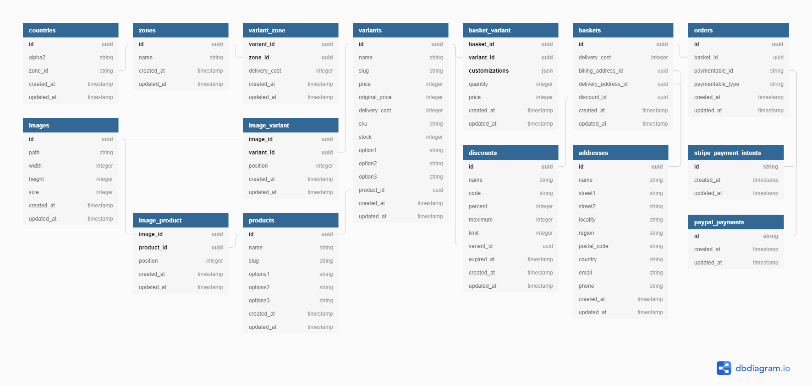

# laravel-shop (work in progress)

## Contents

- [Contents](#contents)
- [About](#about)
- [Design](#design)
    - [API Endpoints](#api-endpoints)
        - [POST /shop-api/addresses](#)
        - [GET /shop-api/addresses/{address}](#)
        - [PUT /shop-api/addresses/{address}](#)
        - [DELETE /shop-api/addresses/{address}](#)
        - [POST /shop-api/baskets](#)
        - [GET /shop-api/baskets/{basket}](#)
        - [PUT /shop-api/baskets/{basket}](#)
        - [DELETE /shop-api/baskets/{basket}](#)
        - [GET /shop-api/baskets/{basket}/variants](#)
        - [POST /shop-api/baskets/{basket}/variants/{variant}](#)
        - [GET /shop-api/baskets/{basket}/variants/{variant}](#)
        - [PUT /shop-api/baskets/{basket}/variants/{variant}](#)
        - [DELETE /shop-api/baskets/{basket}/variants/{variant}](#)
        - [GET /shop-api/countries](#)
        - [GET /shop-api/countries/{country}](#)
        - [GET /shop-api/discounts/{discount}](#)
        - [GET /shop-api/images](#)
        - [GET /shop-api/images/{image}](#)
        - [GET /shop-api/images/{image}/products](#)
        - [GET /shop-api/images/{image}/products/{product}](#)
        - [GET /shop-api/images/{image}/variants](#)
        - [GET /shop-api/images/{image}/variants/{variant}](#)
        - [GET /shop-api/products](#)
        - [GET /shop-api/products/{product}](#)
        - [GET /shop-api/products/{product}/images](#)
        - [GET /shop-api/products/{product}/variants](#)
        - [POST /shop-api/orders](#)
        - [GET /shop-api/orders/{order}](#)
        - [GET /shop-api/variants](#)
        - [GET /shop-api/variants/{variant}](#)
        - [GET /shop-api/variants/{variant}/images](#)
        - [GET /shop-api/variants/{variant}/zones](#)
        - [GET /shop-api/variants/{variant}/zones/{zone}](#)
        - [GET /shop-api/zones/](#)
        - [GET /shop-api/zones/{zone}](#)
        - [GET /shop-api/zones/{zone}/countries](#)
        - [GET /shop-api/zones/{zone}/variants](#)
    - [Entity-Relationship Diagram](#entity-relationship-diagram)

## About

A package for Laravel based projects providing a shop web API.

## Design

### Entity-Relationship Diagram

